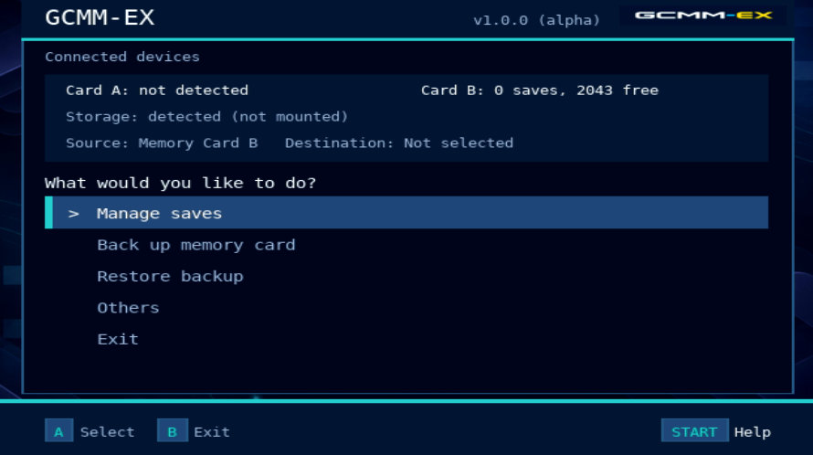
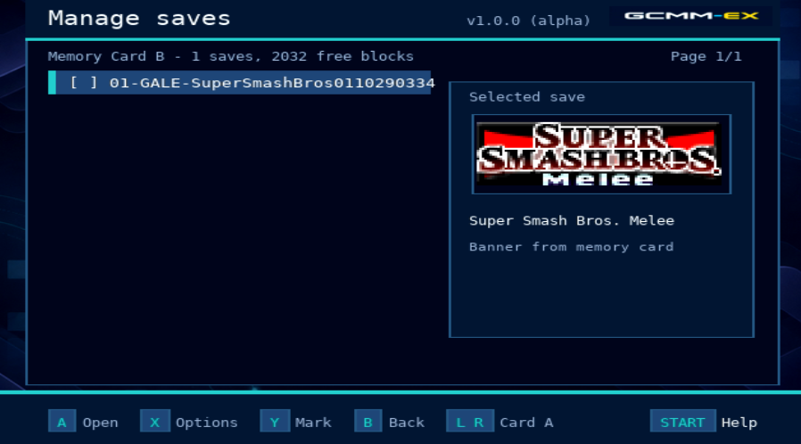
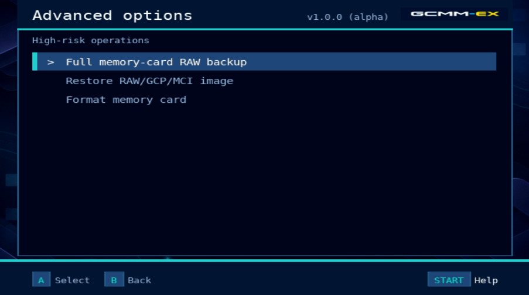

<p align="center">
  
</p>

GCMM-EX is a GameCube memory-card manager with complete memory-card
management and a modern workflow for GameCube and Wii.

<p align="center">
  
  
  
</p>

**Current version:** v1.0.0 (alpha)

- Backup / restore / copy / move
- GCI backup, GCI GCS SAV restore
- RAW, GCP and MCI card images
- Both memory-card slots
- Banners and animated icons
- SD, SD Gecko, SD2SP2, USB, GC Loader

Every operation preserves the compatibility requirements of real console
hardware.

## A new project built on proven code

GCMM-EX has a completely new interface, navigation model, visual design, and
user workflow. It is not a cosmetic revision of the original application: the
user-facing feature set and experience were redesigned for this project, with
little of the original UI behavior remaining.

The project deliberately reuses substantial low-level code from GCMM where it
is required for GameCube memory-card compatibility, save formats, and hardware
safety. That technical foundation does not reduce the originality of GCMM-EX's
interface and product design, and all original authors remain credited below.

> [!WARNING]
> Formatting a card and restoring a complete card image are destructive. Keep
> a verified backup, confirm the source and destination, and never remove a
> memory card or storage device while an operation is running.

## What it does

- Manage saves on either GameCube memory-card slot.
- Back up saves as GCI files and restore GCI, GCS, and SAV files.
- Copy or move saves between cards. A move verifies the copied payload before
  deletion of the source save.
- Create complete memory-card RAW backups and restore RAW, GCP, or MCI images.
- Show save details, banners, and animated icons.
- Format a memory card only after an explicit destructive confirmation.
- Select supported storage without restarting the application.
- Use GameCube controllers, Wii Remotes, or Wii Classic Controllers where
  supported by the platform.

Protected saves, including F-Zero GX and Phantasy Star Online saves, retain the
serial and checksum handling required for restoration to another card.

## Supported platforms, storage, and filesystems

| Platform | Supported storage |
| --- | --- |
| Wii | Front SD, USB, SD Gecko in Slot A, SD Gecko in Slot B |
| GameCube | SD2SP2, SD Gecko in Slot A, SD Gecko in Slot B, GC Loader |

The storage layer supports FAT12, FAT16, FAT32, and exFAT through libdvm.
FAT32 remains the most broadly compatible option for homebrew use.

GCMM-EX selects storage from **Others → Storage devices**. After changing a
device, return to that screen to detect and mount it again. Avoid connecting
more than one USB storage device in Wii mode.

## Installation

### Wii — Homebrew Channel

1. Create `apps/gcmm` on an SD card or USB device.
2. Copy `releases/gcmm_ex_WII.dol` to that directory as `boot.dol`.
3. Copy `hbc/meta.xml` and `hbc/icon.png` to the same directory.
4. Start GCMM-EX from the Homebrew Channel.

### GameCube

Run `releases/gcmm_ex_GC.dol` from a compatible loader, such as Swiss or SDLoad.

## Controls

| Action | GameCube controller | Wii Remote / Classic Controller |
| --- | --- | --- |
| Navigate | D-pad or analog stick | D-pad |
| Select or confirm | `A` | `A` |
| Back or cancel | `B` | `B` |
| Save actions | `X` | `+` / Classic `X` |
| Mark saves | `Y` | `-` / Classic `Y` |
| Previous or next storage device | `L` / `R` | `1` / `2` |
| Help | `Start` | `HOME` / Classic `+` |

The home screen provides **Manage saves**, **Back up memory card**, **Restore
backup**, **Others**, and **Exit**. Complete-card backup, restoration, and formatting
are under **Others → Advanced options**.

## Save-data safety

- A RAW image is a complete memory-card copy. Restore it only to its original
  card unless you understand the compatibility and data-loss risks.
- RAW restoration validates image type, size, header, card capacity, and Flash
  ID before writing. Keep `FLASHIDCHECK` enabled.
- GCI backup files are size-verified after writing to storage.
- Never swap memory cards or storage media while an operation is in progress.
- Use disposable virtual cards for destructive emulator tests.

## Build from source

### Configure the toolchain

Install this public toolchain on the host. GCMM-EX requires devkitPPC,
libogc2, libdvm, PowerPC FreeType, zlib, and Python 3 for DOL section
alignment.

1. Install devkitPro pacman and the GameCube/Wii development groups by
   following the official [devkitPPC getting-started guide](https://devkitpro.org/wiki/Getting_Started/devkitPPC).
2. Install [libogc2](https://github.com/extremscorner/libogc2) using its
   upstream installation instructions. When asked for the filesystem provider,
   choose `libogc2-libdvm`, not `libogc2-libfat`; GCMM-EX requires libdvm for
   partition probing and exFAT support.
3. Install [libdvm](https://github.com/extremscorner/libdvm), PowerPC FreeType
   (`ppc-freetype`), and zlib through the same package manager or their
   upstream instructions.

Do not build devkitPPC from source unless you are developing the toolchain
itself. Use the package installation method documented by devkitPro.

After installation, create a local `.env` file in the GCMM-EX root. Adjust
`DEVKITPRO` only if your devkitPro installation uses a different location.
`.env` is ignored by Git and must remain local to each developer.

```sh
DEVKITPRO="/opt/devkitpro"
DEVKITPPC="$DEVKITPRO/devkitPPC"
PORTLIBS="$DEVKITPRO/portlibs/ppc"
PATH="$DEVKITPPC/bin:$DEVKITPRO/tools/bin:$PORTLIBS/bin:$PATH"

# Optional: required only by scripts/run-dolphin.sh.
# DOLPHIN="/path/to/dolphin-emu"
```

Verify that the installed toolchain exposes the required compiler and FreeType
helper before building:

```sh
source .env
powerpc-eabi-gcc --version
freetype-config --version
```

### Build commands

```sh
source .env
make       # Build GameCube and Wii
make gc    # GameCube only
make wii   # Wii only
make clean # Remove generated outputs
```

If `freetype-config` is missing, install the PowerPC FreeType port or follow
its package documentation before building. Do not substitute host FreeType
libraries for the PowerPC target libraries.

| Target | DOL output |
| --- | --- |
| GameCube | `releases/gcmm_ex_GC.dol` |
| Wii | `releases/gcmm_ex_WII.dol` |

Intermediate objects use `build_GC/` and `build_WII/`. Build outputs are
generated files and are not versioned.

## Dolphin smoke testing

The launcher uses an isolated Dolphin user directory at
`tests/dolphin/user/`, which is ignored by Git.

```sh
scripts/run-dolphin.sh --gc
scripts/run-dolphin.sh --wii
```

Set `DOLPHIN` in `.env` when the executable is not on `PATH`. Windows Dolphin
paths work under WSL. The launcher configures an isolated test profile: Slot A
is disabled, and Slot B uses the RAW image `memorycards/backup.USA.raw`. It is
copied on first use to Dolphin's USA-region test-card path under
`tests/dolphin/user/GC/GCMM-EX/`, so test writes do not alter the source file.
Run `scripts/run-dolphin.sh --setup` to prepare only the profile.

### Reloading the emulated card

Ordinary runs keep whatever the emulated card already holds, so a test that
wrote to the card carries its result into the next run. Reload the card when
the next test needs a known starting point:

```sh
scripts/run-dolphin.sh --reset-card         # reload backup.USA.raw, then exit
scripts/run-dolphin.sh --gc --reset-card    # reload it, then launch
scripts/run-dolphin.sh --import other.raw   # load a different image instead
```

Both flags overwrite the emulated card and discard its current contents; the
source file is never modified. The image must be a whole number of 8 KiB
blocks, or the launcher reports the size and stops before copying anything.

Configure controllers before testing; see
[tests/dolphin/README.md](tests/dolphin/README.md) for the checklist and
emulator limitations.

## Repository layout

```text
source/              Application entry point and shared code
source/ui/           Controller UI, font, bitmap, banner, and icon rendering
source/storage/      CARD driver, save files, storage, and RAW-image handling
source/aram/         GameCube-only auxiliary-RAM DOL loader
data/                Shared assets
data-gc/             GameCube-specific assets
data-wii/            Wii-specific assets
hbc/                 Homebrew Channel metadata and icon
scripts/             Development and emulator helpers
tests/dolphin/       Dolphin smoke-test documentation and local test data
releases/            Generated DOL and ELF outputs
Makefile.gc          GameCube build configuration
Makefile.wii         Wii build configuration
```

See [source/README.md](source/README.md) for source-module boundaries, shared
buffer ownership, binary-format constraints, and contributor guidance.

## Credits and license

GCMM-EX reuses important technical code from
[GCMM by suloku](https://github.com/suloku/gcmm), which was started by dsbomb
and justb from Askot's libogc `mcbackup` work. It preserves the contributions
of suloku, dsbomb, justb, Askot, SoftDev, Costis, Masken,
CowTRobo, Samsom, Tantric, tueidj, dronesplitter, PabloACZ, Pikachu025,
Nano/Excelsiior, bm123456, themanuel, DacoTaco, Extrems, fincs, ChaN,
dragonbane0, Zephiles, Ralf, f3bandit, and other contributors.

See [changelog.md](changelog.md) for release history. GCMM-EX is distributed
under the [MIT License](LICENSE.md).
